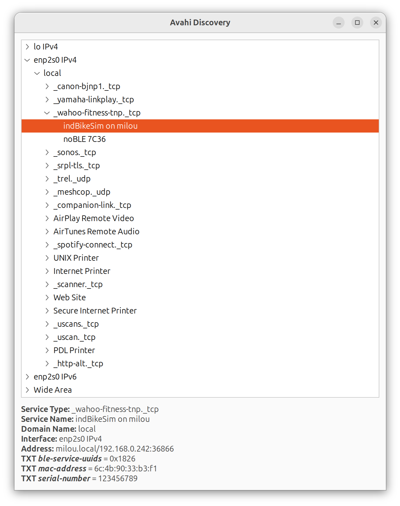
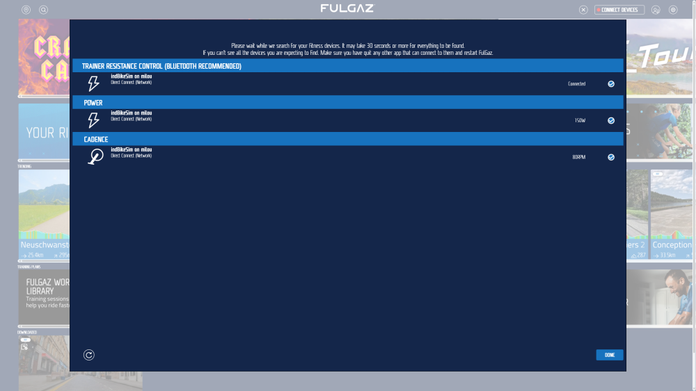
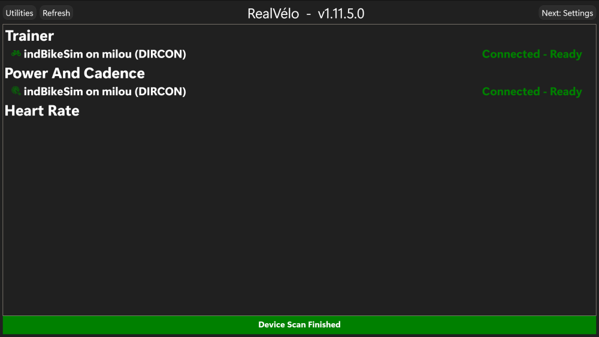
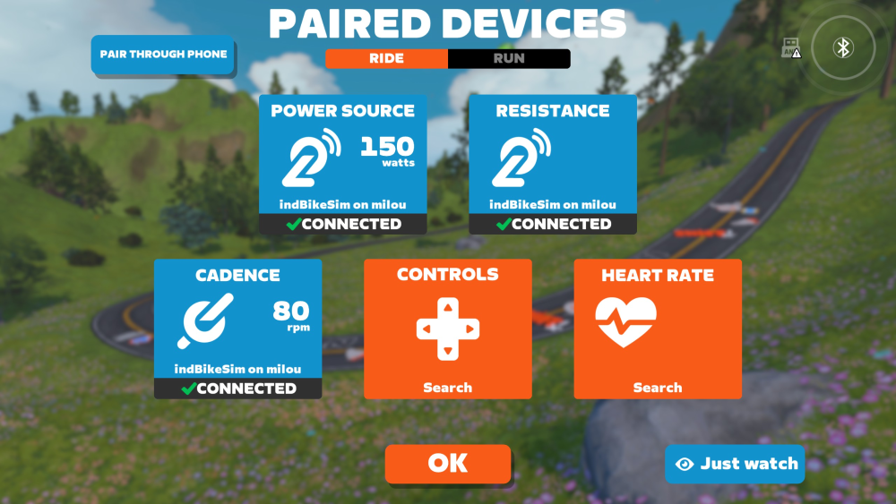

# Introduction

indBikeSim is an app that simulates a basic FTMS Indoor Bike device. It supports the following features:

* Uses Direct Connect (DIRCON) as the communication protocol with the virtual cycling app.
* Uses the Avahi Daemon to advertise the wahoo-fitness-tnp (WFTNP) service on the local network.
* The FTMS Indoor Bike Data notifications include cadence, heart rate, power, and speed.
* The cadence, heart rate, power, and speed values can be specified via command-line arguments or obtained from the trackpoints in a FIT file.
* Has the option to include a Cycling Power Service (CPS) for reporting power and cadence.

# Building the app

The file config.h can be used to enable/disable a few features, such as the optional CPS.

The app is written in C and can be built simply by running make:

``` bash
make
```

# Installing the app

indBikeSim uses the Avahi Daemon to advertise the WFTNP service on the local network. That's how a DIRCON-compatible virtual cycling app (e.g. FulGaz, Zwift) can discover and connect to it.

The supplied file wahoo-fitness-tnp.service is a template to be used by the Avahi Daemon to advertise the WFTNP service.  The service definition includes a TXT record that specifies the Serial Number of the indoor bike device, and the MAC address of its network interface.  You need to set the dummy SN and MAC values in the template file to their correct values, before copying the file to the Avahi system folder.

For example, if the desired serial number is 123456789 and the network interface on the host running the indBikeSim app is enp2s0, you can set the "serial-number" and "mac-address" TXT records as follows:

``` bash
sed -i s"/SN/123456789/" wahoo-fitness-tnp.service
sed -i s"/MAC/`cat /sys/class/net/enp2s0/address`/" wahoo-fitness-tnp.service
```

**NOTE:** If you have enabled the optional CPS feature, make sure to add the CPS's UUID 0x1818 to the comma-separated list in the ble-service-uuids TXT record: 

```
<txt-record>ble-service-uuids=0x1826,0x1818</txt-record>
```

Then you can install the service definition file as follows:

``` bash
sudo cp wahoo-fitness-tnp.service /etc/avahi/services/
sudo systemctl restart avahi-daemon
```

To ensure that the new service is being advertised correctly on the local network, you can use the avahi-browse utility:

``` bash
avahi-browse -rt _wahoo-fitness-tnp._tcp
```

The output should look like this:

```
+ enp2s0 IPv6 indBikeSim on milou                           _wahoo-fitness-tnp._tcp local
+ enp2s0 IPv4 indBikeSim on milou                           _wahoo-fitness-tnp._tcp local
+     lo IPv4 indBikeSim on milou                           _wahoo-fitness-tnp._tcp local
= enp2s0 IPv6 indBikeSim on milou                           _wahoo-fitness-tnp._tcp local
   hostname = [milou.local]
   address = [fe80::3fb4:c8a9:101f:ed8a]
   port = [36866]
   txt = ["ble-service-uuids=0x1826" "mac-address=6c:4b:90:33:b3:f1" "serial-number=123456789"]
= enp2s0 IPv4 indBikeSim on milou                           _wahoo-fitness-tnp._tcp local
   hostname = [milou.local]
   address = [192.168.0.242]
   port = [36866]
   txt = ["ble-service-uuids=0x1826" "mac-address=6c:4b:90:33:b3:f1" "serial-number=123456789"]
=     lo IPv4 indBikeSim on milou                           _wahoo-fitness-tnp._tcp local
   hostname = [milou.local]
   address = [127.0.0.1]
   port = [36866]
   txt = ["ble-service-uuids=0x1826" "mac-address=6c:4b:90:33:b3:f1" "serial-number=123456789"]
```

Alternatively, you can use the Avahi Discovery app to check that the service is properly configured. In the example below the service was advertised by the Ubuntu host "milou" over its wired network interface enp2s0:



# Running the app

indBikeSim supports a few command-line arguments, that can be listed by running the app with the --help option:

```
SYNTAX:
    indBikeSim [OPTIONS]

OPTIONS:
    --activity <file>
        Specifies the FIT file of the cycling activity to be used to
        get the metrics sent in the 'Indoor Bike Data' notification
        messages.
    --cadence <val>
        Specifies a fixed cadence value (in RPM) to be sent in the
        periodic 'Cycling Power Measurement' and 'Indoor Bike Data'
        notifications.
    --dissect <mesg-id>
        Dissect the WFTNP messages that match the specified message ID
        Valid values are:
          0 - any
          1 - Discover Services
          2 - Discover Characteristics
          3 - Read Characteristic
          4 - Write Characteristic
          5 - Enable Characteristic Notifications
          6 - Unsolicited Characteristic Notification
    --heart-rate <val>
        Specifies a fixed heart rate value (in BPM) to be sent
        in the periodic 'Indoor Bike Data' notifications.
    --help
        Show this help and exit.
    --hex-dump
        Do a hex dump of the DIRCON messages sent and received.
    --ip-address <addr>
        Specifies the interface IP address to use to advertise the
        WFTNP mDNS service.
    --log-dest {both|console|file}
        Specifies the destination of the log messages. The default is
        'console'.
    --log-level {none|info|trace|debug}
        Set the specified message log level. The default level is
        "info".
    --power <val>
        Specifies a fixed pedal power value (in Watts) to be sent
        in the periodic 'Indoor Bike Data' notifications.
    --speed <val>
        Specifies a fixed speed value (in km/h) to be sent
        in the periodic 'Indoor Bike Data' notifications.
    --supported-power-range <min,max,inc>
        Specifies the minimum, maximum, and increment power values
        (in Watts) used by the Supported Power Range characteristic.
        Default is 0,1500,1.
    --tcp-port <num>
        Specifies the TCP port to use. Default is 36866.
    --version
        Show version information and exit.

BUGS:
    Report bugs and enhancement requests to: marcelo_mourier@yahoo.com
```

The screenshots below show the FulGaz, RealVelo, and Zwift virtual cycling apps using indBikeSim as the resistance, power, cadence, and heart rate devices:







# References

[Bluetooth SIG Fitness Machine Service Specification](https://www.bluetooth.com/specifications/specs/html/?src=ftms-v1-0-1_1756429637/FTMS_v1.0.1/out/en/index-en.html)

[Bluetooth SIG Cycling Power Service Specification](https://www.bluetooth.com/specifications/specs/html/?src=CPS_v1.1/out/en/index-en.html)

[Bluetooth SIG GATT Specification Supplement](https://btprodspecificationrefs.blob.core.windows.net/gatt-specification-supplement/GATT_Specification_Supplement.pdf)
